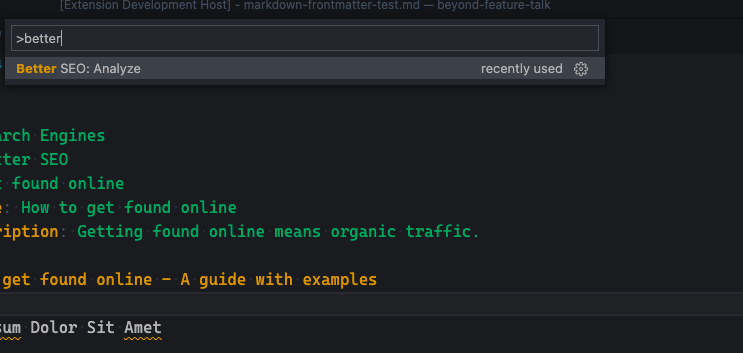
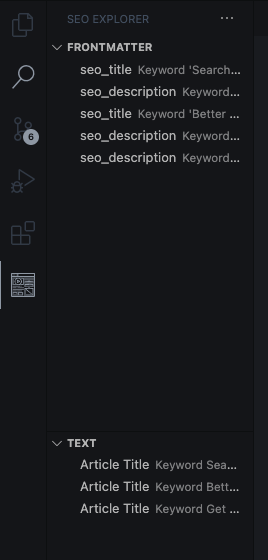

# Better SEO

Are you a Software Developer using [VSCode](https://code.visualstudio.com/) to write Blog Posts and do you care about getting found on Google? This extension is for you!

You might already be using third-party tools to ensure SEO compliance outside of VSCode such as [Yoast SEO in Wordpress](https://yoast.com/wordpress/plugins/seo/). But back-porting changes from Wordpress back to your Markdown file is tedious. It takes a long time and the article is already finished.
Better SEO provides you with feedback directly in VSCode, so you can produce high-quality content that gets found by search engines.

## Features

Better SEO expects some meta information in your Markdown file:

```
---
keywords:
    - Search Engines
    - Better SEO
    - Get found online
seo_title: How to get found online
seo_description: Getting found online means organic traffic.
---
# How to get found online - A guide with examples
```

An article needs a `seo_title` and `seo_description`. These are the equivalent fields for `SEO TITLE` and `SEO/Meta Description` on your blog. Also, if you're using any keyword research tools such as [Google Keyword Planner](https://ads.google.com/home/tools/keyword-planner/), [ahrefs](ahrefs.com) or [SEMRush](https://www.semrush.com/), use `keywords` to keep track of your keywords for this article.

### How to use it

Press `Ctrl+Shift+P`/`Cmd+Shift+P` to open the command menu and type in `Better SEO: Analyze`.



If you have `keywords` is present in your Markdown file, Better SEO will use the keywords in your file for the analysis. If `keywords` is not present, it will ask you to provide one.

Once the analysis is completed, you will see the results in the TreeView:



### What it validates

- The blog post's title (The first occurrence of a first-level headline)
- Does the keyword occur in `seo_title`?
- Does the keyword occur in `seo_description`?
- The text length of `seo_title`
- The text length of `seo_description`

## Release Notes

Users appreciate release notes as you update your extension.

### 1.0.0

Initial release of Better SEO

## License

MIT